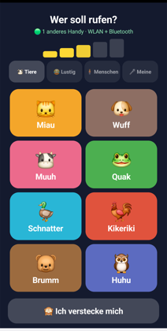
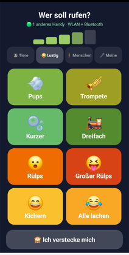
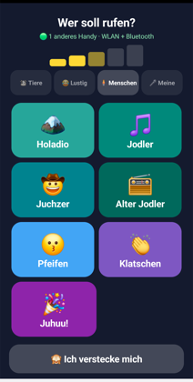
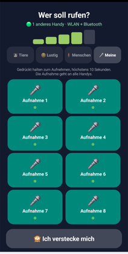
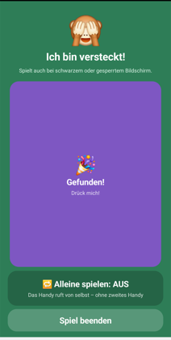
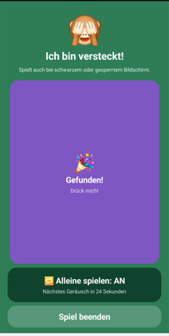

# Versteckspiel 🙈

Ein Versteckspiel für Kinder (ca. 3–6 Jahre), bei dem Handys die Verstecke sind.
Ein Handy ruft Geräusche, die versteckten Handys antworten – und die Kinder
suchen nach dem Miauen unterm Sofa.

Läuft komplett offline: kein Internet, kein Server, keine Anmeldung, keine
Werbung. Die Handys finden sich selbst, über WLAN **oder** Bluetooth.

| Tiere | Lustig | Menschen |
|---|---|---|
|  |  |  |

| Eigene Aufnahmen | Versteckt | Alleine spielen |
|---|---|---|
|  |  |  |

## Spielen

1. `Versteckspiel.apk` auf **alle** Handys installieren.
2. Jedes Handy startet als **Fernbedienung**.
3. Wer zuerst ein Geräusch antippt, übernimmt die Steuerung – **alle anderen
   Handys wechseln von selbst in den Versteckmodus** und spielen das Geräusch ab.
4. Handys verstecken. Dann rufen und suchen.
5. Gefunden? Auf dem gefundenen Handy **🎉 Gefunden!** drücken: es jubelt und wird
   zur neuen Fernbedienung, die anderen verstecken sich. **Rollentausch.**

Es spielen beliebig viele Handys mit – eines steuert, alle anderen machen
Geräusche.

**Alleine spielen:** Im Versteckmodus den Schalter umlegen. Das Handy ruft dann
von selbst alle 20–40 Sekunden ein Geräusch, mit Countdown bis zum nächsten Mal.
So geht das Spiel auch mit einem einzigen Handy. In diesem Modus wird nichts
gefunkt, andere Handys bleiben also unbehelligt.

**23 Geräusche in drei Reitern, plus eigene Aufnahmen:**

| Reiter | Inhalt |
|---|---|
| 🐮 Tiere | Miau, Wuff, Muuh, Quak, Schnatter, Kikeriki, Brumm, Huhu |
| 😂 Lustig | vier Pupse, zwei Rülpser, Kichern, Alle lachen |
| 🧍 Menschen | vier Jodler, Pfeifen, Klatschen, Juhuu |
| 🎤 Meine | acht Plätze für selbst aufgenommene Geräusche |

### Näherungspegel

Über der Reiterleiste zeigen fünf Balken, wie nah das nächste versteckte Handy
ist – **rot heißt weit weg, grün heißt ganz nah**. Die Schätzung kommt aus der
Bluetooth-Signalstärke, ist also grob (Wände und Körper dämpfen stark), reicht
aber fürs Warm-Kalt-Gefühl. Ganz ohne Text, damit auch Dreijährige es lesen
können, die noch nicht lesen können.

### Eigene Geräusche

Im Reiter 🎤 eine Kachel **gedrückt halten** – es wird aufgenommen, solange der
Finger liegen bleibt, höchstens zehn Sekunden. Die Aufnahme geht anschließend an
alle anderen Handys, danach kann jedes sie abspielen. Einmal „Mamaaa!" aufnehmen,
und es ertönt aus jedem Versteck.

Die Punkte unter jeder Kachel zeigen pro Handy, ob es die Aufnahme schon hat:
grün ja, orange noch unterwegs, grau leer. Fehlt sie irgendwo, wird sie
automatisch nachgeliefert – so holen auch Handys auf, die beim Aufnehmen nicht
dabei waren.

#### Wie die Aufnahme zu den anderen kommt

Über WLAN gehen die Daten als UDP-Pakete an die bekannten Handys. **Ohne WLAN
über eine echte BLE-Verbindung** (GATT) – die braucht ebenfalls kein Pairing.
Gemessen auf zwei Samsung-Geräten mit abgeschaltetem WLAN: eine 36-KB-Aufnahme in
**0,8 Sekunden**, rund 45 KB/s.

Das reine Advertising, über das die Spielbefehle laufen, taugt dafür nicht: Dort
passen nach Abzug aller Kopfdaten **17 Byte** in ein Paket, und der Inhalt lässt
sich nur durch Neustart des Advertisings wechseln. Eine Aufnahme bräuchte
tausende Pakete und damit Minuten – deshalb der Umweg über eine Verbindung.

Wer eine Aufnahme hat, ist dabei GATT-Server; wem sie fehlt, verbindet sich,
nennt die Platznummer und bekommt die Daten als Notifications. Schlägt ein Abruf
fehl, ist nichts verloren: Der Abgleich läuft alle zehn Sekunden erneut.

## Installieren

```sh
adb install -r Versteckspiel.apk
```

Oder die Datei aufs Handy kopieren und antippen (Installation aus unbekannter
Quelle einmalig erlauben). Die App ist mit dem Debug-Schlüssel signiert – für
daheim reicht das, für den Play Store bräuchte es einen eigenen Keystore.

Beim ersten Start fragt die App nach Benachrichtigungen, Bluetooth und einer
Ausnahme von der Akku-Optimierung. Alle drei sind nötig, siehe unten.

## Wie es funktioniert

Es gibt keine festen Rollen im Netz, sondern eine einzige Regel:

> **Wer sendet, steuert. Wer empfängt, versteckt sich.**


Daraus ergeben sich Rollentausch, automatisches Umschalten und der Betrieb mit
mehreren Handys von selbst – ohne Aushandlung und ohne Zustand, der auseinander
laufen kann. Geht ein Funkpaket verloren, ist nichts kaputt: der nächste
Tastendruck sortiert die Rollen neu.

| Nachricht | Wirkung beim Empfänger |
|---|---|
| `PLAY:<nr>` | Geräusch abspielen, Versteckmodus |
| `FOUND` | Jubeln, Versteckmodus (der Sender wird Fernbedienung) |
| `PING` | nur Anwesenheit, **ändert keine Rollen**; trägt nebenbei, welche Aufnahmeplätze belegt sind |

Jede Nachricht trägt eine zufällige Absenderkennung und eine laufende Nummer.
Die Kennung sorgt dafür, dass ein Gerät den eigenen mitgehörten Broadcast
verwirft – sonst würde die Fernbedienung ihre eigenen Geräusche abspielen. Die
laufende Nummer wirft Doppelte weg, die über beide Funkwege ankommen.

### Zwei Funkwege gleichzeitig

| | WLAN | Bluetooth |
|---|---|---|
| Technik | UDP-Broadcast, Port 45678 | BLE-Advertising, **kein Pairing** |
| Voraussetzung | gemeinsames WLAN | nur Bluetooth an |
| Reichweite | ganze Wohnung | ~10–15 m, Wände dämpfen stark |
| Nachricht | Klartext, mitlesbar | 9 Byte binär |
| Aufnahmen | UDP-Pakete | GATT-Verbindung, ~45 KB/s |

Beide laufen parallel, die Statuszeile zeigt welche aktiv sind. Ohne WLAN trägt
Bluetooth das Spiel allein – gemessen auf zwei Samsung-Geräten bei
ausgeschaltetem WLAN, schlafendem Display und gesperrtem Bildschirm: 4 von 4
Rufen kamen an, Verzögerung 87–247 ms.

BLE-Pakete tragen vorne die Signatur `VS`, und der Scan-Filter lässt nur solche
durch. Ohne das würden fremde Geräte als Mitspieler gezählt – die verwendete
Hersteller-Kennung `0xFFFF` ist frei benutzbar, also funken auch andere darunter.

### Bildschirm aus, Handy gesperrt

Das ist der Normalfall beim Verstecken, also muss es zuverlässig laufen. Dafür:

- **Foreground Service** – Android beendet den Prozess nicht
- **Partial Wake Lock** – die CPU verarbeitet eingehende Pakete weiter
- **WiFi Lock** – das WLAN geht im Standby nicht schlafen
- **Scan-Filter** – ohne ihn liefert Android bei dunklem Display gar keine
  BLE-Treffer mehr
- Befehle bleiben **3,5 Sekunden** in der Luft, weil Android das Scannen
  phasenweise aussetzt; ein kurz gefunkter Befehl fällt sonst in so eine Pause

Die Medienlautstärke wird vor jedem Geräusch auf Maximum gesetzt.

**Leiser, je näher man kommt:** Das versteckte Handy hört ja selbst, wie stark
das Signal des Suchers ist. Je näher der ist, desto leiser ruft es – höchstens
auf die Hälfte herunter, sonst findet man es gar nicht mehr. Das macht die
letzten Meter spannend.

**Akku-Optimierung:** Eine App, die dauernd funkt und einen Wake-Lock hält, gilt
den Herstellern als Akkufresser – Samsung bietet nach wenigen Minuten an, sie ins
„tiefe Standby" zu schicken, was das Spiel abwürgen würde. Die App fragt deshalb
beim ersten Start einmalig nach einer Ausnahme. Falls das abgelehnt wurde:
*Einstellungen → Apps → Versteckspiel → Akku → Uneingeschränkt*.

**Abschaltautomatik:** Wenn zehn Minuten lang niemand ruft, beendet sich das
Spiel von selbst. Ein vergessenes Handy soll nicht den halben Tag funken. Wer
früher aufhören will, drückt **Spiel beenden** oder beendet es in der
Benachrichtigung.

## Aufbau

| Datei | Inhalt |
|---|---|
| `MainActivity.kt` | beide Ansichten, komplett programmatisch |
| `LevelView.kt` | der Näherungspegel |
| `Recordings.kt` | selbst aufgenommene Geräusche |
| `GattTransfer.kt` | Aufnahmen über eine BLE-Verbindung verschicken |
| `Protocol.kt` | Nachrichtenformat für beide Funkwege |
| `Links.kt` | `UdpLink` und `BleLink` |
| `Net.kt` | `Peer` (Rollenlogik), `SoundBox` |
| `Sounds.kt` | Reiter und Kacheln |
| `PlayerService.kt` | hält das Gerät im Hintergrund wach |

Kein Compose, kein AppCompat, keine einzige externe Abhängigkeit. APK ~3 MB.

## Bauen und testen

```sh
gradle :app:assembleDebug
adb install -r app/build/outputs/apk/debug/app-debug.apk
```

`tools/fake_phone.py` simuliert ein weiteres Handy vom Rechner aus: sendet
Anwesenheit und `PLAY`, protokolliert alles Empfangene. Praktisch, um das
Protokoll ohne zweites Gerät zu prüfen (Broadcast-Adresse im Skript anpassen).

`tools/build_sounds.py` lädt die Aufnahmen von Wikimedia Commons, sucht
automatisch den energiereichsten Abschnitt, schneidet ihn heraus und normalisiert
ihn. Herkunft und Lizenzen aller Geräusche: [CREDITS.md](CREDITS.md).

## Lizenz

Der Code steht unter der [MIT-Lizenz](LICENSE).

Die Geräusche nicht – sie stammen von Wikimedia Commons und behalten ihre
eigenen Lizenzen (CC0, Public Domain, CC BY-SA 3.0/4.0). Wer sie weitergibt,
muss die Urheber nennen; alle Angaben dazu stehen in [CREDITS.md](CREDITS.md).
